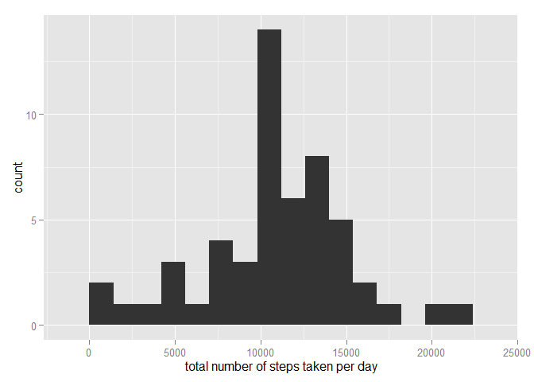
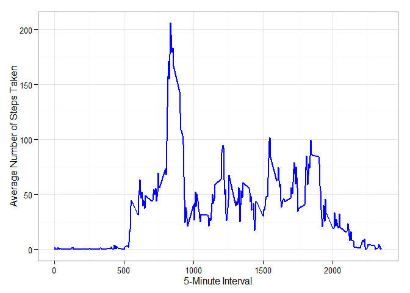
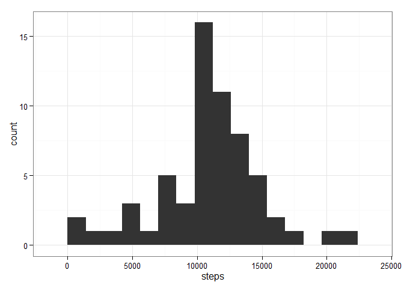
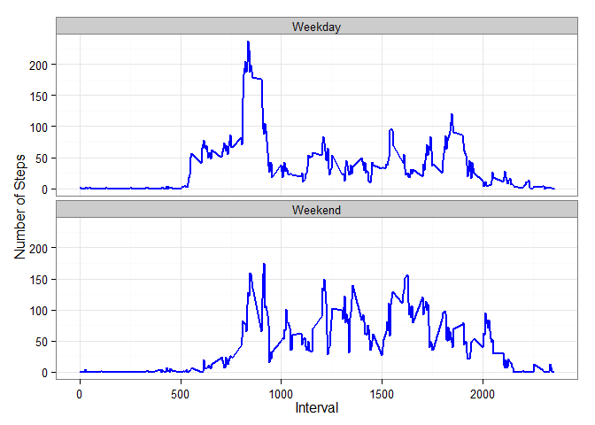

# Reproducible Research: Peer Assessment 1

##Introduction

It is now possible to collect a large amount of data about personal movement using activity monitoring devices such as a Fitbit, Nike Fuelband, or Jawbone Up. These type of devices are part of the "quantified self" movement - a group of enthusiasts who take measurements about themselves regularly to improve their health, to find patterns in their behavior, or because they are tech geeks. But these data remain under-utilized both because the raw data are hard to obtain and there is a lack of statistical methods and software for processing and interpreting the data.

This assignment makes use of data from a personal activity monitoring device. This device collects data at 5 minute intervals through out the day. The data consists of two months of data from an anonymous individual collected during the months of October and November, 2012 and include the number of steps taken in 5 minute intervals each day.

##Data

The data for this assignment can be downloaded from the course web site:

https://d396qusza40orc.cloudfront.net/repdata%2Fdata%2Factivity.zip

Dataset: Activity monitoring data [52K]
The variables included in this dataset are:

- steps: Number of steps taking in a 5-minute interval (missing values are coded as NA)

- date: The date on which the measurement was taken in YYYY-MM-DD format

- interval: Identifier for the 5-minute interval in which measurement was taken

The dataset is stored in a comma-separated-value (CSV) file and there are a total of 17,568 observations in this dataset.


## Loading and preprocessing the data
Check if source file exist in working directory, if not download repdata-data-activity.zip
and extract activity.cvs and create data from activity.csv

```r
setwd("C:/COURSERA/ReproducibleResearch")

if(!file.exists("repdata-data-activity")) {
        fileURL <- "http://d396qusza40orc.cloudfront.net/repdata%2Fdata%2Factivity.zip"
        download.file(fileURL, destfile = "repdata-data-activity.zip")
        file.name <- "repdata-data-activity.zip"
        unzip(file.name)
        unlink(file.name)
        }
 data <- read.csv("activity.csv",colClasses = c("numeric","Date","numeric"))
```

## What is mean total number of steps taken per day?
 Using aggregate function,
 aggregate steps as per date to get total number of steps in a day and then plot histogram
 and display mean/median of total number of steps taken per day  
1.- Make a histogram of the total number of steps taken each day  
2.- Calculate and report the mean and median total number of steps taken per day    
For this part of the assignment ignore missing values in the dataset
 

```r
stepsbyday <- aggregate(steps ~ date, data, sum,na.rm=TRUE)
library(ggplot2)
qplot(steps, data=stepsbyday,  binwidth = 1400,
         xlab = "total number of steps taken per day")
```

 

```r
mean(stepsbyday$steps, na.rm = TRUE)
```

```
## [1] 10766
```

```r
median(stepsbyday$steps, na.rm = TRUE)
```

```
## [1] 10765
```


## What is the average daily activity pattern?
Time series plot of the 5-minute interval and the average number of steps taken, 
 averaged across all days  
1.-  Make a time series plot (i.e. type = "l") of the 5-minute interval (x-axis) and the average number of steps taken, averaged across all days (y-axis)  
2.- Which 5-minute interval, on average across all the days in the dataset, contains the maximum number of steps?

```r
avepathern5min <- aggregate(steps ~ interval, data, mean, na.rm = TRUE)
ggplot(avepathern5min, aes(x=interval,y=steps)) + 
  geom_line(color="blue",size=1) +  
  labs(x="5-Minute Interval",y="Average Number of Steps Taken") +
  theme_bw()
```

 


5-minute interval containing the maximum number of steps (averaged across all days)

```r
  avepathern5min[which.max(avepathern5min$steps), ]
```

```
##     interval steps
## 104      835 206.2
```


## Imputing missing values
Note that there are a number of days/intervals where there are missing values (coded as NA). The presence of missing days may introduce bias into some calculations or summaries of the data.

1.- Calculate and report the total number of missing values in the dataset (i.e. the total number of rows with NAs)

2.- Devise a strategy for filling in all of the missing values in the dataset. The strategy does not need to be sophisticated. For example, you could use the mean/median for that day, or the mean for that 5-minute interval, etc.

3.- Create a new dataset that is equal to the original dataset but with the missing data filled in.

4.- Make a histogram of the total number of steps taken each day and Calculate and report the mean and median total number of steps taken per day. Do these values differ from the estimates from the first part of the assignment? What is the impact of imputing missing data on the estimates of the total daily number of steps?

Number of NA (missing) step values in the dataset

```r
missing <- is.na(data$steps)
table(missing)
```

```
## missing
## FALSE  TRUE 
## 15264  2304
```

Method of imputted missing steps values: All of the missing values are replaced with the mean value for that 5-minute interval and day.
A new dataset is created using the imputed values average of steps by interval by day.  
Get the day of week for each date then calculate their average steps

```r
data$day <- weekdays(data$date)
dayAve <- aggregate(steps ~ interval + day, data, mean, na.rm = TRUE) 
```
Merge (add two columns to the original data)

```r
activityComplete <- merge(data, dayAve, by=c("interval", "day"))
```
Replace NA values by interval average of current day (y)

```r
activityComplete <- transform(activityComplete, steps.x = ifelse(is.na(steps.x),steps.y,steps.x))
```
Keep the first 4 columns and rename the columns and rounds numbers of steps with 0 digits and then sort the new dataframe by date and interval

```r
activityComplete <- data.frame(activityComplete[,1:4])
names(activityComplete) <- c("interval", "day","steps", "date")
activityComplete$steps <- round(activityComplete$steps, digits = 0)
activityComplete <- activityComplete[order(activityComplete$date, activityComplete$interval),]
```

Histogram of the total number of steps taken per day with imputed values

```r
activityCompleteAgg <- aggregate(steps ~ date, activityComplete, sum, na.rm = TRUE)
qplot(steps, data = activityCompleteAgg, binwidth = 1400) +
        theme_bw()
```

 


Mean and Median steps per day with imputed values:

```r
mean(activityCompleteAgg$steps)
```

```
## [1] 10821
```

```r
median(activityCompleteAgg$steps)
```

```
## [1] 11015
```


By including the imputed values in the dataset, both the median and the mean total number of 
steps taken per day increase, as expected. 
A comparison of histograms for the non-imputed and imputed datasets demonstrates that the 
imputation had the greatest impact on the 10,000 - 15,000 steps per day range and that the 
 distribution of data with the imputed data appears to be more normal.


## Are there differences in activity patterns between weekdays and weekends?
For this part the weekdays() function may be of some help here. Use the dataset with the filled-in missing values for this part.

1.- Create a new factor variable in the dataset with two levels - "weekday" and "weekend" indicating whether a given date is a weekday or weekend day.

2.- Make a panel plot containing a time series plot (i.e. type = "l") of the 5-minute interval (x-axis) and the average number of steps taken, averaged across all weekday days or weekend days (y-axis).

```r
activityComplete$Weekday <- ifelse(activityComplete$day %in% c("Saturday", "Sunday"),"Weekend", "Weekday")
activityCompleteWeekDay <- aggregate(steps ~ interval + Weekday, activityComplete, mean)
ggplot(activityCompleteWeekDay, aes(x=interval,y=steps)) + 
        geom_line(color="blue",size=1) + 
        facet_wrap(~Weekday, nrow=2, ncol=1) + 
        labs(x="Interval",y="Number of Steps") +
        theme_bw()
```

 
 
 
 Yes there are difference between weekdays and weekends as shown in the plots above.
